# Resilio System Architecture - Mermaid Diagrams

## 1. High-Level System Architecture

```mermaid
graph TB
    subgraph Client["🖥️ CLIENT LAYER"]
        Browser["Web Browser"]
        React["React SPA<br/>(Port 5170)"]
        Browser --> React
    end

    subgraph API["🔌 API GATEWAY LAYER"]
        FastAPI["FastAPI REST API<br/>(Port 8001)"]
        CORS["CORS Middleware"]
        Auth["JWT Auth"]
        OrgContext["Organization Context<br/>(X-Org-ID)"]
        
        CORS --> FastAPI
        Auth --> FastAPI
        OrgContext --> FastAPI
    end

    subgraph Business["⚙️ BUSINESS LOGIC LAYER"]
        Routers["Routers<br/>• suppliers<br/>• network<br/>• risk<br/>• alerts<br/>• recommendations<br/>• simulator"]
        Engines["Engines<br/>• risk_engine<br/>• graph_engine<br/>• prediction_engine<br/>• recommendation_engine<br/>• scenario_engine"]
        DataGen["Data Generators<br/>• company_data<br/>• seed_data"]
        
        Routers --> Engines
        Routers --> DataGen
    end

    subgraph Data["💾 DATA LAYER"]
        Supabase["Supabase PostgreSQL<br/>• User Authentication<br/>• User Profiles<br/>• JWT Management"]
        Cache["In-Memory Cache<br/>• Company Data<br/>• Suppliers<br/>• Dependencies<br/>• Alerts"]
    end

    React -->|HTTP/JSON| FastAPI
    FastAPI --> Routers
    Engines --> Supabase
    Engines --> Cache
    DataGen --> Cache

    style Client fill:#1e3a8a,stroke:#3b82f6,stroke-width:2px,color:#fff
    style API fill:#065f46,stroke:#10b981,stroke-width:2px,color:#fff
    style Business fill:#7c2d12,stroke:#f97316,stroke-width:2px,color:#fff
    style Data fill:#581c87,stroke:#a855f7,stroke-width:2px,color:#fff
```

## 2. Frontend Component Architecture

```mermaid
graph LR
    subgraph App["App.jsx"]
        Router["React Router"]
        AuthProvider["Auth Provider"]
        Toaster["Toast Notifications"]
    end

    subgraph Pages["📄 Pages"]
        Login["Login"]
        Signup["Signup"]
        Dashboard["Executive Dashboard"]
        Network["Network Graph"]
        Risk["Risk Intelligence"]
        Alerts["Predictive Alerts"]
        Simulator["Resilience Simulator"]
    end

    subgraph Components["🧩 Components"]
        Sidebar["Sidebar"]
        PrivateRoute["Private Route"]
        KPICard["KPI Card"]
        RiskBadge["Risk Badge"]
    end

    subgraph API_Layer["🌐 API Layer"]
        APIClient["Axios Client<br/>(api/index.js)"]
        Interceptors["Request Interceptors<br/>• Add JWT Token<br/>• Add X-Org-ID"]
    end

    subgraph Context["📦 Context"]
        AuthContext["Auth Context<br/>• User State<br/>• Company Profile<br/>• Sign In/Out"]
    end

    subgraph External["☁️ External"]
        Supabase["Supabase Client"]
    end

    Router --> Pages
    AuthProvider --> AuthContext
    Pages --> Components
    Pages --> API_Layer
    PrivateRoute --> AuthContext
    API_Layer --> Interceptors
    Interceptors --> AuthContext
    AuthContext --> Supabase

    style Pages fill:#1e40af,stroke:#3b82f6,stroke-width:2px,color:#fff
    style Components fill:#0e7490,stroke:#06b6d4,stroke-width:2px,color:#fff
    style API_Layer fill:#047857,stroke:#10b981,stroke-width:2px,color:#fff
    style Context fill:#7c2d12,stroke:#f97316,stroke-width:2px,color:#fff
```

## 3. Backend Component Architecture

```mermaid
graph TB
    subgraph Main["main.py"]
        App["FastAPI App"]
        Middleware["CORS Middleware"]
    end

    subgraph Routers["📡 API Routers"]
        SupplierRouter["suppliers.py<br/>GET /suppliers<br/>GET /suppliers/:id"]
        NetworkRouter["network.py<br/>GET /network/graph<br/>GET /network/spof"]
        RiskRouter["risk.py<br/>GET /risk/overview<br/>GET /risk/top-risky"]
        AlertRouter["alerts.py<br/>GET /alerts<br/>GET /alerts/summary"]
        RecRouter["recommendations.py<br/>GET /recommendations"]
        SimRouter["simulator.py<br/>GET /simulator/scenarios<br/>POST /simulator/run"]
    end

    subgraph Engines["⚙️ Processing Engines"]
        RiskEngine["risk_engine.py<br/>• compute_risk_scores<br/>• get_overview<br/>• get_top_risky"]
        GraphEngine["graph_engine.py<br/>• build_graph<br/>• get_centrality<br/>• simulate_disruption"]
        PredEngine["prediction_engine.py<br/>• get_alerts<br/>• get_disruption_probability"]
        RecEngine["recommendation_engine.py<br/>• get_recommendations<br/>• find_alternatives"]
        ScenarioEngine["scenario_engine.py<br/>• run_scenario<br/>• cascade_analysis"]
    end

    subgraph Data["📊 Data Layer"]
        CompanyData["company_data.py<br/>• get_company_data<br/>• generate_suppliers"]
        SeedData["seed_data.py<br/>• get_data<br/>• base_generation"]
        OrgDep["org_dep.py<br/>• get_org<br/>• org_validation"]
        Cache["_caches dict<br/>Per-org cached data"]
    end

    subgraph DB["💾 Database"]
        Supabase["Supabase Client<br/>supabase_client.py"]
    end

    App --> Middleware
    App --> Routers
    
    SupplierRouter --> CompanyData
    NetworkRouter --> GraphEngine
    RiskRouter --> RiskEngine
    AlertRouter --> PredEngine
    RecRouter --> RecEngine
    SimRouter --> ScenarioEngine
    
    Routers --> OrgDep
    
    RiskEngine --> GraphEngine
    PredEngine --> RiskEngine
    RecEngine --> RiskEngine
    ScenarioEngine --> RiskEngine
    ScenarioEngine --> GraphEngine
    
    GraphEngine --> CompanyData
    RiskEngine --> CompanyData
    CompanyData --> Cache
    CompanyData --> SeedData
    
    Engines --> Supabase

    style Routers fill:#1e40af,stroke:#3b82f6,stroke-width:2px,color:#fff
    style Engines fill:#047857,stroke:#10b981,stroke-width:2px,color:#fff
    style Data fill:#7c2d12,stroke:#f97316,stroke-width:2px,color:#fff
```

## 4. Authentication Flow

## 5. API Request Flow

## 6. Data Generation Flow

## 7. Risk Scoring Algorithm

## 8. Disruption Cascade Simulation

## 9. Multi-Organization Architecture

## 10. Deployment Architecture

---

## How to Use These Diagrams

1. **Copy the mermaid code blocks** from any diagram above
2. **Paste into any Mermaid-compatible viewer**:
   - GitHub Markdown (will render automatically)
   - [Mermaid Live Editor](https://mermaid.live/)
   - VS Code with Mermaid extension
   - Notion, Confluence, or other documentation tools
3. **Customize** colors, labels, or structure as needed

## Diagram Types Used

- **graph TB/LR**: Top-to-bottom or left-to-right graphs
- **flowchart TD/LR**: Flowcharts with more shape options
- **sequenceDiagram**: Time-based interaction flows

---

**Generated for**: Resilio Supply Chain Analyzer  
**Date**: February 28, 2026  
**Version**: 1.0.0
